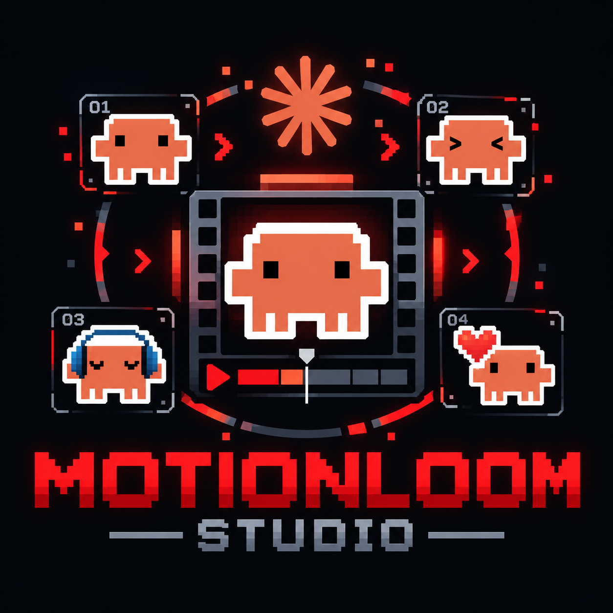
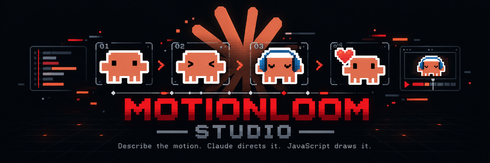

<p align="center"> 

# MotionLoom Studio

MotionLoom Studio is an open-source Claude Code plugin and skill system for deterministic JavaScript motion graphics: procedural animation, character animation, and SaaS/AI launch videos.

Most AI video tools hand you pixels and a shrug. You can't scrub them, inspect them, or figure out why frame 340 looks wrong. MotionLoom does the opposite: animation is code. Claude acts as motion director and animation engineer, writing Canvas, p5.js, SVG, and Remotion scenes you can scrub, re-render, inspect frame by frame, and export at consistent quality.

Claude Code plugins package reusable skills for distribution — MotionLoom uses that to give Claude a repeatable production workflow instead of one-off scripts.

---

## What MotionLoom is
<p align="center">
  
</p>
  
Three layers, not one starter template:

1. **Skill layer** — Claude learns how to read a creative brief, storyboard motion, pick a visual grammar, and revise.
2. **Studio layer** — live preview, timeline scrubbing, parameter editing, visual QA.
3. **Engine layer** — deterministic rendering via Remotion and Canvas/p5.js.

The real product is the motion-design intelligence baked into the skill layer. The starter code is just where it runs.

---

## Core idea

```text
Creative brief
  -> prompt refinement
  -> visual system
  -> shot plan
  -> deterministic scene code
  -> live preview
  -> contact sheets / strips / QA
  -> final MP4 export
```

A typical task:

```text
Create a 15-second launch video for an AI code review tool.
Use dark slate surfaces, amber cursor energy, premium motion,
clean kinetic typography, and a recurring morph token.
Storyboard first. Render contact sheets before MP4 export.
```

Claude reads the brief, picks a renderer profile, plans shots, writes the deterministic scene code, previews it, fixes whatever's off in timing or transitions, and exports.

---

## Key features

### Claude-native workflow

Plugin + skills architecture. Motion-design instructions live in `skills/motionloom/`. Separate agents handle direction, live editing, and visual QA — this isn't one giant prompt trying to do everything at once [web:157].

### 6-phase prompt optimizer

Turns "make it cool" into an actual plan:

1. Intent detection
2. Scope assessment
3. Component matching
4. Missing-context analysis
5. Renderer/model recommendation
6. Execution-ready prompt construction

### Three renderer profiles

| Profile | Best for | Stack |
|---|---|---|
| `product-launch` | SaaS demos, UI reveals, bento layouts, product storytelling | Remotion + React + Canvas/SVG |
| `pure-procedural` | Character acting, loops, natural-media motion, procedural art | Canvas / p5.js / p5.brush |
| `hybrid` | Mixed UI + procedural scenes | Remotion timeline + procedural layers |

Remotion handles programmatic video rendering from JavaScript, which fits timeline-driven launch videos well. p5.js gives a browser-native surface that's a better fit for procedural and generative motion.

### Deterministic render contract

```js
renderScene(ctx, t, sceneState, seededRng)
```

Frame `t` looks the same whether you got there by normal playback, random-access scrubbing, headless export, a contact sheet, or a transition strip. No state drift, no "it worked yesterday" debugging sessions.

### Offscreen caching

Memoize the expensive stuff — paper texture, stipple/hatch fields, vector marks, static UI chrome, decorative backgrounds — without giving up deterministic output.

### Persistent visual tokens

Motifs that survive shot boundaries: glowing cursor pills, energy ribbons, scan lines, motion trails, traveling highlights. This is what stops a 20-second video from feeling like five unrelated clips stitched together.

### Taste loops

For a hero hook or a key transition, MotionLoom can generate a few alternatives — restrained, balanced, expressive — so you're comparing actual renders instead of imagining them.

### Visual evidence, not code review

Animation bugs live in frames, not source. MotionLoom leans on contact sheets, cut-boundary strip renders, stills, determinism checks, safe-area scanning, and transition audits.

### Live Studio

A local environment for scrubbing the timeline, tweaking parameters, inspecting objects, and steering Claude through a patch-accept workflow. Animation as code and as visual state, editable either way.

---

## Quick start

### 1. Clone and run

```bash
git clone https://github.com/vishnu-tppr/motionloom-studio.git
cd motionloom-studio
npm install
npm run dev
```

Open `http://localhost:4173`.

### 2. Run validation and evidence renders

```bash
npm test

npm run contact
npm run strip
npm run still
npm run video
```

Expected outputs: `out/contact.png`, `out/strip.png`, `out/still.png`, `out/video.mp4`.

### 3. Use the live studio

```bash
npm run live
```

Scrub shots, preview transitions, inspect scene parameters, steer revisions — all before you spend time on a final export.

---

## Claude Code install

Claude Code plugins package skills as a namespaced, reusable unit [web:157].

```text
/plugin marketplace add vishnu-tppr/motionloom-studio
/plugin install motionloom-studio@motionloom-marketplace
```

Then in Claude Code:

```text
/motionloom-studio:motionloom Create a 15-second high-end SaaS launch video
for an AI code review tool. Use dark slate surfaces, glass bento cards,
an amber cursor morph token, premium spring motion, and crisp kinetic type.
Storyboard first and render contact sheets before exporting MP4.
```

If you add more skills, document them here too:

```text
/motionloom-studio:motionloom
/motionloom-studio:product-video
/motionloom-studio:character-film
/motionloom-studio:visual-qa
```

---

## Architecture

```text
.claude-plugin/             Plugin + marketplace manifests
skills/motionloom/          Claude Code skill instructions
  references/
    prompt-optimizer.md     Brief-to-spec pipeline
    renderer-profiles.md    product-launch / pure-procedural / hybrid
    engine-contract.md      Deterministic render contract
    product-motion.md       SaaS UI motion language
    character-film.md       Character motion and acting
    procedural-art.md       Procedural systems and marks

agents/
  director/                 Shot planning and creative direction
  live-editor/              Live steering and structured changes
  visual-qa/                Render inspection and defect reporting

engine/
  src/
    core.js                 Seeded RNG, math, camera helpers
    motion.js               Springs, lag chains, easing, causal motion
    procedural.js           Offscreen caching, morph paths, token systems
    typography.js           Kinetic typography primitives
    product.js              UI cards, code panes, bento layouts
    character.js            2D character rig primitives
    timeline.js             Shot timing and transitions

  tools/
    render.mjs              Headless renderer
    live-server.mjs         Local steering bridge
    detector.mjs            Determinism and visual checks
```

---

## Determinism and QA

Four gates, all aimed at catching regressions before they ship.

**Purity test.** A frame at `t = X` has to be pixel-stable no matter how you seeked to get there.

**Transition audit.** Cut-boundary strips get checked for velocity continuity, token continuity, timing pops, one-frame flashes, awkward object jumps.

**Fast-readability test.** Subject and typography hierarchy should read almost instantly after a cut. Matters most for product-launch motion, where the viewer's attention span is short.

**Safe-area and composition checks.** The detector can flag cropped text, unsafe edge placement, low-contrast type, dead frames, broken token continuity.

---

## Rendering model

Different jobs need different backends. That's the whole reason three profiles exist instead of one:

| Profile | Best for | Primary stack |
|---|---|---|
| `product-launch` | SaaS launch videos, UI reveals, product storytelling | Remotion + React + Canvas/SVG |
| `pure-procedural` | Character acting, loops, painterly motion, procedural art | Canvas / p5.js / p5.brush |
| `hybrid` | Mixed UI + procedural scenes | Remotion timeline + procedural layers |


---

## Design principles

- **Determinism first.** A frame has to be reproducible, or debugging is guesswork.
- **Rendered evidence over guesswork.** Look at the image. Don't trust the code.
- **Persistent visual memory.** Recurring tokens are what make a 20-second video feel like one thing instead of five clips.
- **Truthful product motion.** Don't animate a feature the product doesn't actually have.
- **Technique follows brief.** Pick the renderer for the job, not the other way around.
- **Storyboard before code.** Direction comes first.

---

## Why this exists

Most AI video output is opaque — hard to inspect, hard to revise, impossible to reproduce exactly. MotionLoom goes the other way: animation systems that are transparent, editable, deterministic, and sit in version control like normal code.

That's useful for open-source collaboration, agencies doing repeated launches, and anyone experimenting with a visual system who doesn't want to start over every time.

---

## Current status

> Experimental, under active development. Expect the plugin structure, renderer APIs, and studio tooling to keep shifting.

What's next: better live editing, richer path morphing, more renderer adapters, sharper visual detectors, real audio/timeline orchestration, and more demo scenes so new contributors have something to copy from.

---

## Contributing

Renderer adapters, motion primitives, visual QA detectors, demo scenes, style packs, docs. Remotion product templates and p5.js character scenes are probably the highest-leverage places to start if you're not sure where to jump in.

---

## License

MIT © MotionLoom Studio Contributors
